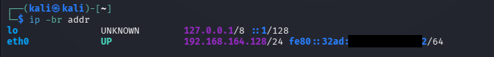
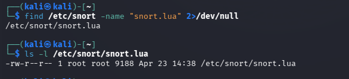
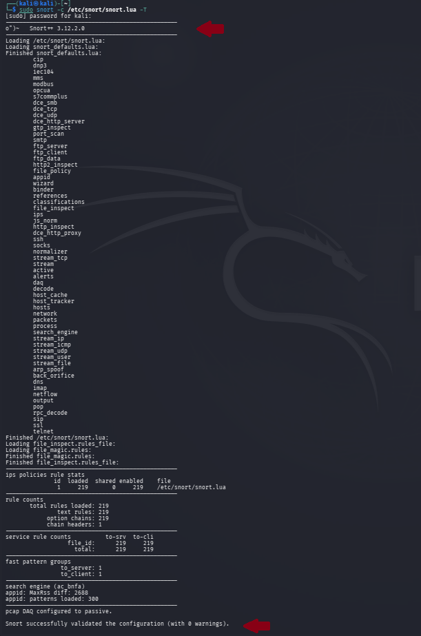

# Evidence 02 — Snort Configuration

## Objective

The objective of this step was to configure and validate Snort 3 for network traffic monitoring in the authorized cybersecurity laboratory environment.

## Snort Version

The installed Snort version was verified during the installation phase.

The laboratory environment uses:

    Snort++ 3.12.2.0

## Network Interface Identification

The available network interfaces were identified using:

    ip -br addr

This command was used to identify the active network interface and its assigned IP address before configuring live traffic monitoring.

## Configuration File

The Snort 3 configuration file was located using:

    find /etc/snort -name "snort.lua" 2>/dev/null

The primary Snort 3 configuration file used for this assessment was:

    /etc/snort/snort.lua

Snort 3 uses Lua-based configuration files to define configuration settings, modules, logging behavior, and rule loading.

## Configuration Validation

The configuration was validated using:

    sudo snort -c /etc/snort/snort.lua -T

The `-c` option specifies the Snort configuration file, while `-T` validates the configuration without starting normal live traffic processing.

## Validation Result

The configuration validation completed successfully.

The validation confirmed that the Snort configuration could be loaded successfully and was ready for the subsequent rule-development and traffic-detection phases.

## Security Relevance

Correct configuration is essential for an Intrusion Detection System because Snort must successfully load its configuration before it can inspect network traffic and apply detection rules.

A configuration validation step helps identify configuration errors before starting live network monitoring.

## Evidence Screenshots

### Network Interface

The screenshot shows the network interfaces identified on the Kali Linux laboratory machine.

### Snort Configuration File

The screenshot shows the location and existence of the Snort 3 configuration file.

### Configuration Validation

The screenshot provides evidence that the Snort configuration was successfully validated.

## Result

Snort 3 configuration was successfully located and validated.

The Snort engine is ready for the custom-rule development and network detection phases.

## Conclusion

The configuration phase established the required Snort 3 configuration for the authorized laboratory environment.

The next phase will focus on creating custom detection rules for ICMP traffic, port scanning, and SSH brute-force activity.

## Authorization

This activity was performed exclusively within an authorized cybersecurity laboratory environment for educational and security-training purposes.

No unauthorized systems were targeted.
