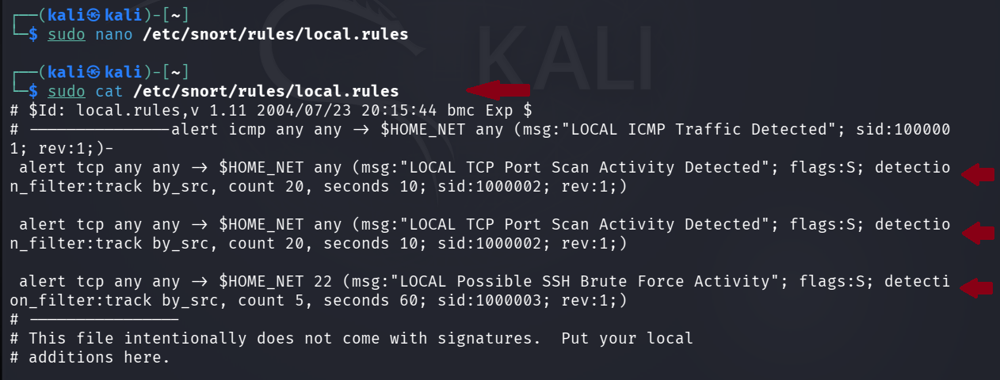

# Evidence 03 — Custom Snort Rules

## Objective

The objective of this step was to create custom Snort 3 detection rules for identifying ICMP traffic, TCP port-scan activity, and repeated SSH connection attempts in an authorized cybersecurity laboratory environment.

## Custom Rules File

The custom rules were stored in:

    /etc/snort/rules/local.rules

## Rule 1 — ICMP Detection

    alert icmp any any -> $HOME_NET any (msg:"LOCAL ICMP Traffic Detected"; sid:1000001; rev:1;)

### Purpose

This rule generates an alert when ICMP traffic matching the rule is observed.

### Rule Identifier

    sid:1000001

---

## Rule 2 — TCP Port Scan Detection

    alert tcp any any -> $HOME_NET any (msg:"LOCAL TCP Port Scan Activity Detected"; flags:S; detection_filter:track by_src, count 20, seconds 10; sid:1000002; rev:1;)

### Purpose

This rule looks for repeated TCP SYN packets from the same source within a short time window.

The detection filter is used to reduce individual packet alerts and identify repeated connection attempts consistent with port-scanning activity.

### Rule Identifier

    sid:1000002

---

## Rule 3 — SSH Brute-Force Detection

    alert tcp any any -> $HOME_NET 22 (msg:"LOCAL Possible SSH Brute Force Activity"; flags:S; detection_filter:track by_src, count 5, seconds 60; sid:1000003; rev:1;)

### Purpose

This rule detects repeated TCP connection attempts toward the SSH service on TCP port 22.

The rule is intended to identify possible SSH brute-force activity at the network level.

It does not independently verify whether individual authentication attempts succeeded or failed.

### Rule Identifier

    sid:1000003

---

## Rule Summary

| SID | Detection | Protocol | Destination |
|---|---|---|---|
| 1000001 | ICMP Traffic | ICMP | `$HOME_NET` |
| 1000002 | TCP Port Scan Activity | TCP | `$HOME_NET` |
| 1000003 | Possible SSH Brute Force | TCP | `$HOME_NET:22` |

## Rule Verification

The custom rules were reviewed using:

    sudo cat /etc/snort/rules/local.rules

The output was checked to ensure that all three custom rules were present.

## Evidence Screenshot

The screenshot shows the custom rules configured for the laboratory IDS exercise.

## Security Relevance

Custom rules allow security analysts to define detection logic for traffic patterns that are specifically relevant to their environment.

In this practical, custom rules were created for:

- ICMP traffic
- Repeated TCP connection attempts
- Repeated SSH connection attempts

## Result

Three custom Snort detection rules were created successfully.

The rules are ready to be loaded and tested against authorized laboratory traffic.

## Conclusion

The custom-rule phase established the detection logic required for the subsequent ICMP, port-scan, and SSH brute-force detection exercises.

## Authorization

This activity was performed exclusively within an authorized cybersecurity laboratory environment for educational and security-training purposes.

No unauthorized systems were targeted.
