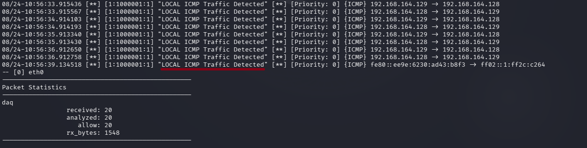

# Evidence 04 — ICMP Detection

## Objective

The objective of this step was to verify that the custom Snort rule successfully detects ICMP traffic in the authorized cybersecurity laboratory environment.

## Detection Rule

The ICMP detection rule configured during the custom-rule phase was:

    alert icmp any any -> $HOME_NET any (msg:"LOCAL ICMP Traffic Detected"; sid:1000001; rev:1;)

## Snort Startup

Snort was started using the configured Lua configuration file, the custom rules file, and the selected laboratory network interface.

### Command

    sudo snort -c /etc/snort/snort.lua -R /etc/snort/rules/local.rules -i <INTERFACE> -A alert_fast

The `<INTERFACE>` value represents the active network interface used by the authorized laboratory environment.

## ICMP Test

ICMP traffic was generated from the authorized testing machine using:

    ping -c 4 <TARGET-IP>

The test generated ICMP Echo Request traffic toward the authorized laboratory target.

## Detection Result

Snort inspected the generated traffic and matched the custom ICMP detection rule.

The resulting alert message was:

    LOCAL ICMP Traffic Detected

This confirmed that the custom ICMP rule was loaded and capable of generating an alert when matching ICMP traffic was observed.

## Security Relevance

ICMP is commonly used for network diagnostics and connectivity testing.

Monitoring ICMP traffic can provide useful visibility into network activity and can help security analysts identify unexpected or unusual ICMP communication.

## Evidence Screenshot

The screenshot shows the Snort alert generated after the authorized ICMP test.

## Result

The custom ICMP detection rule successfully generated an alert for the authorized laboratory ICMP traffic.

## Conclusion

The ICMP detection phase successfully demonstrated how a custom Snort rule can identify and alert on matching network traffic.

## Authorization

This activity was performed exclusively within an authorized cybersecurity laboratory environment for educational and security-training purposes.

No unauthorized systems were targeted.
