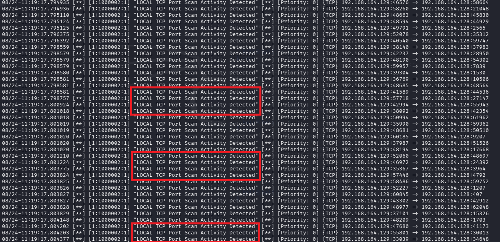

# Evidence 05 — Port Scan Detection

## Objective

The objective of this step was to detect repeated TCP connection attempts associated with port-scanning activity using a custom Snort rule in the authorized cybersecurity laboratory environment.

## Detection Rule

The configured port-scan detection rule was:

    alert tcp any any -> $HOME_NET any (msg:"LOCAL TCP Port Scan Activity Detected"; flags:S; detection_filter:track by_src, count 20, seconds 10; sid:1000002; rev:1;)

## Detection Logic

The rule monitors TCP SYN packets directed toward the configured `$HOME_NET`.

A detection filter tracks repeated SYN packets from the same source within a defined time window.

The configured threshold is:

    count 20
    seconds 10

This means the rule is intended to alert when at least 20 matching TCP SYN packets from the same source are observed within 10 seconds.

## Snort Startup

Snort was started using:

    sudo snort -c /etc/snort/snort.lua -R /etc/snort/rules/local.rules -i <INTERFACE> -A alert_fast

The `<INTERFACE>` value represents the active network interface used by the authorized laboratory environment.

## Port Scan Test

A controlled TCP SYN scan was performed against the authorized laboratory target.

### Command

    nmap -sS -p 1-100 <TARGET-IP>

The scan generated multiple TCP SYN packets toward the target.

## Detection Result

Snort monitored the traffic and evaluated the packets against the custom port-scan detection rule.

When the configured threshold was reached, Snort generated the alert:

    LOCAL TCP Port Scan Activity Detected

## Security Relevance

Port scanning is commonly used during network reconnaissance to identify accessible ports and potentially exposed services.

Detecting repeated connection attempts can provide security monitoring visibility into reconnaissance activity.

## Evidence Screenshot

The screenshot shows the Snort alert generated during the authorized port-scan test.

## Result

The custom Snort rule successfully detected the configured pattern of repeated TCP SYN traffic generated during the authorized laboratory scan.

## Conclusion

The port-scan detection phase demonstrated how Snort can use custom rules and detection thresholds to identify repeated TCP connection attempts associated with reconnaissance activity.

## Authorization

This activity was performed exclusively within an authorized cybersecurity laboratory environment for educational and security-training purposes.

No unauthorized systems were targeted.
